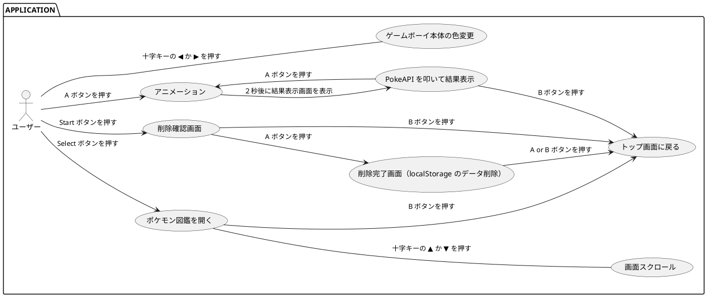

# ポケガチャ！

## 概要

心がホカホカすること間違いなしのゲームボーイ UI でポケモンをガチャガチャできるアプリケーションです。

## ポケガチャ！を制作した背景

プログラミングを学習し始めてしばらく経った頃に静的な Web サイトしか作ったことがなかったので、 API を叩いて何か作りたい！と思い制作しました。

このドキュメント執筆時（2022 年 6 月）大きく３つのフェーズを辿っています。

1. とりあえず作ってみた
2. バグが起きないように作ってみた
3. 保守性と可読性を意識して作ってみた

3 終了現在、IT エンジニアに転職して１ヶ月と少しなので保守性と可読性の面に関しては今後もアップデートしていきたいと考えています。

## 目的

以下の力を身につけることを目的にこのアプリケーションを制作しました。

- 動的なアプリケーションが作れること
- 公開されている API を叩いてデータ取得ができること
- 意図しない挙動を起こさないようにできること
- Logic と View を切り分けて実装できること
- テストを実装できること (Unit)
- ユーザーに何かしらかの感動を与えられること

## 今後取り組みたいこと

- GraphQL でのデータ取得
- e2e テスト

## 制作物

ゲームボーイの UI で以下の機能をもった Web アプリケーションを制作します。

- [PokeAPI](https://pokeapi.co/) から初代ポケモン (No.1~151) のデータをランダムに取得し画面表示する
- 過去に抽選で選ばれたポケモンのデータを localStorage に保存しポケモン図鑑で閲覧できる
- localStorage のデータは GUI から削除できる

## ユースケース図

GitHub でユースケース図を閲覧するには GoogleChrome 拡張機能の [Pegmatite](https://chrome.google.com/webstore/detail/pegmatite/jegkfbnfbfnohncpcfcimepibmhlkldo) が必要です。



## 使用技術

- Next.js
- TypeScript
- ESLint
- Prettier
- Jest
- Playwright
- Storybook
- Recoil
- SWR
- Tailwind CSS

## デザインの解説

Storybook でデザインカタログを作成しています。

アプリケーションを clone していれば以下のコマンドで Storybook を起動できます。

```bash
npx run sb

or

yarn sb
```

こだわった部分の解説は以下です。

このあたりは私の [Qiita での記事](https://qiita.com/takahashi-mcd/items/bbb06be7014896fde7ad#%E3%82%AC%E3%83%81%E3%83%A3%E7%B5%90%E6%9E%9C%E7%94%BB%E9%9D%A2) 執筆時と大体同じになります。

### ゲームボーイのロゴ

[GameBoyLogo.tsx](src/component/molecule/GameBoyLogo/GameBoyLogo.tsx)

[Google Fonts](https://fonts.google.com/) の [Kalam](https://fonts.google.com/specimen/Kalam) というフォントを使っています。

１文字ずつ色を適用しています。

```tsx
<div className="mt-1 font-kalam">
  {["C", "O", "L", "O", "R"].map((item, index) => (
    <span
      key={index}
      data-testid={`${baseId}-${index}`}
      className={
        index === 0
          ? "text-[#FB4E8B]"
          : index === 1
          ? "text-[#AE97F1]"
          : index === 2
          ? "text-[#BBE880]"
          : index === 3
          ? "text-[#FAEB67]"
          : index === 4
          ? "text-[#8CD0FF]"
          : ""
      }
    >
      {item}
    </span>
  ))}
</div>
```

### Speaker

[Speaker.tsx](src/component/molecule/Speaker/Speaker.tsx)

Array.from 関数で 64 個の配列を作成し map 関数で表示しています。

```tsx
<div className="grid grid-cols-8 grid-rows-[8] gap-2 w-20 -skew-y-6">
  {Array.from({ length: 64 }, (_, i) => i + 1).map((item) => (
    <div
      key={item}
      data-testid={`${baseId}-${item}`}
      className={`w-1 h-1 rounded-full
    ${
      item === 1 || item === 8 || item === 57 || item === 64
        ? "bg-transparent"
        : "bg-gray-600"
    }
    `}
    />
  ))}
</div>
```

### Display

[Display.tsx](src/component/project/Display/Display.tsx)

props で screenType を受け取り画面の出し分けをしています。

画面外側枠内の電源ランプとゲームボーイのロゴは `position : absolute;` で配置しています。

```tsx
<div className="flex relative justify-center items-center w-[343px] h-[359px] bg-amber-50 rounded-t-2xl rounded-b-[55px] border-x-[48px] border-t-[32px] border-b-[64px] border-gray-700">
  <Screen />

  <div
    data-testid={`${baseId}-power-supply`}
    className="absolute top-16 left-[-42px]"
  >
    <PowerSupply />
  </div>
  <div
    data-testid={`${baseId}-game-boy-logo`}
    className="flex absolute bottom-[-52px] left-1/2 justify-center w-full -translate-x-1/2"
  >
    <GameBoyLogo />
  </div>
</div>
```

<details>
<summary> Screen の内容</summary>

```tsx
const Screen = () => {
  switch (screenType) {
    case "top":
      return (
        <div data-testid={`${baseId}-top`}>
          <TopScreen />
        </div>
      );
    case "lottery":
      return (
        <div data-testid={`${baseId}-lottery`}>
          <LotteryScreen />
        </div>
      );
    case "result":
      return (
        <div data-testid={`${baseId}-result`}>
          <ResultScreen pokemon={pokemon} />
        </div>
      );
    case "pokedex":
      return (
        <div data-testid={`${baseId}-pokedex`}>
          <PokedexScreen pokemonList={pokemonList} pokedexRef={pokedexRef} />
        </div>
      );
    case "deleteIsConfirm":
      return (
        <div data-testid={`${baseId}-delete-is-confirm`}>
          <DeleteIsConfirmScreen />
        </div>
      );
    case "deleteIsComplete":
      return (
        <div data-testid={`${baseId}-delete-is-complete`}>
          <DeleteIsCompleteScreen />
        </div>
      );
    default:
      return null;
  }
};
```

</details>

## 機能の解説

Qiita 記事執筆時の私のコードを見直したところ、以下の点が問題だと感じました。

- 関数の責務が複雑でわかりにくい
- 全体的に Logic が回りくどい
- 関数が想像したコンポーネント内にない
- Logic と View が混ざっていて可読性が低い
- useEffect で無理やり機能を実装しており、可読性も低い

今回はそのあたりを解消するべく実装してみました。以前のコードを折りたたみで並べています。

### A ボタンの機能

screenType によって A ボタンの機能を出し分けています。

条件分岐が多いので switch 文を使用しています。

以前は button に disabled を持たせて画面によってボタンが動作しないようにしていました。

今回は該当しない screenType では return させるようにすることで余計な記述を減らすことができました。

```tsx
const onAPush = () => {
  switch (screenType) {
    case "top":
    case "result":
      setScreenType("animation");
      lotteryNumber();
      addPokemon();
      addPokemonList();
      const timer = setTimeout(() => {
        setScreenType("result");
      }, 2000);
      () => clearTimeout(timer);
      break;

    case "deleteIsConfirm":
      setScreenType("deleteIsComplete");
      deletePokemonList();
      break;

    case "deleteIsComplete":
      setScreenType("top");
      break;

    default:
      break;
  }
};
```

<details>
<summary>以前のコード</summary>

```tsx
const handlePressA = useCallback(() => {
  if (isDeletionConfirmation) {
    // localStorage のデータ削除
    localStorage.clear();
    setIsDeletionConfirmation(false);
    setIsDeletionCompleted(true);
    return;
  }

  if (isDeletionCompleted) {
    // トップ画面へ遷移
    setIsDeletionCompleted(false);
    return;
  }

  // モンスターボールのアニメーション画面へ遷移
  setIsAnimation(true);
  // 1 〜 151 の番号でランダムに抽選
  const lotteryNumber = Math.floor(Math.random() * (151 - 1) + 1);
  setPokemonId(lotteryNumber);

  // 2秒後にガチャ結果画面を表示
  const timer = setTimeout(() => {
    setIsAnimation(false);
    setIsResultDisplay(true);
  }, 2000);
  return () => clearTimeout(timer);
}, [
  setPokemonId,
  setIsAnimation,
  setIsResultDisplay,
  isDeletionCompleted,
  isDeletionConfirmation,
  setIsDeletionCompleted,
  setIsDeletionConfirmation,
]);
```

</details>

### B ボタンの機能

こちらも A ボタンと同じです。

screenType が animation の時は return し、それ以外ではトップ画面に遷移します。

ポケモン図鑑からトップ画面に遷移する際はスクロール位置をリセットする関数を呼んでいます。

```tsx
const onBPush = () => {
  switch (screenType) {
    case "animation":
      break;

    case "pokedex":
      setScreenType("top");
      resetScroll();

    default:
      setScreenType("top");
      break;
  }
};
```

<details>
<summary>以前のコード</summary>

```tsx
const handlePressB = useCallback(() => {
  setIsResultDisplay(false);
  setIsPokedexBook(false);
  setIsDeletionConfirmation(false);
}, [setIsDeletionConfirmation, setIsPokedexBook, setIsResultDisplay]);
```

</details>

### 使用している Custom Hooks

#### ゲームボーイ本体の色変更機能

最も無駄な機能と自負しております。

現在の bodyColor に応じて State を変更し色を変更します。

[useBodyColor.ts](src/hook/useBodyColor.ts)

```tsx
const switchColor = () => {
  switch (bodyColor) {
    case "red":
      setBodyColor("yellow");
      break;

    case "yellow":
      setBodyColor("purple");
      break;

    case "purple":
      setBodyColor("blue");
      break;

    case "blue":
      setBodyColor("red");
      break;

    default:
      break;
  }
};
```

className 内で条件分岐しています。

```tsx
bodyColor === "red"
  ? "bg-[#C83031]"
  : bodyColor === "yellow"
  ? "bg-[#FED20D]"
  : bodyColor === "purple"
  ? "bg-[#543DB8]"
  : bodyColor === "blue"
  ? "bg-[#1C9ACD]"
  : null;
```

<details>
<summary>以前のコード</summary>

```tsx
const colorNumUp = useCallback(() => {
  // number が3の場合は0にセット
  if (gameBoyColorNum === 3) {
    setGameBoyColorNum(0);
    return;
  }
  setGameBoyColorNum(gameBoyColorNum + 1);
}, [gameBoyColorNum, setGameBoyColorNum]);

const colorNumDown = useCallback(() => {
  // number が0の場合は3にセット
  if (gameBoyColorNum === 0) {
    setGameBoyColorNum(3);
    return;
  }
  setGameBoyColorNum(gameBoyColorNum - 1);
}, [gameBoyColorNum, setGameBoyColorNum]);
```

</details>

#### ランダムな番号出力機能

ポケモンのデータを取得するために 1~151 のランダムな数字を返します。
抽選で選ばれた番号は Recoil で管理しています。

この関数自体は前回とほとんど一緒ですが、 Custom Hooks に切り出すことで関数の管理とテストがしやすくなりました。

[useLottery.ts](src/hook/useLottery.ts)

```tsx
const lotteryNumber = () =>
  setWinningNumber(Math.floor(Math.random() * (151 - 1)) + 1);
```

#### ポケモンデータ取得機能

下記の関数を含みます。

- 抽選で選ばれた番号を使用し PokeAPI を叩き、データを返す
- 抽選で選ばれたデータを localStorage に保存する
- localStorage に保存された pokemonList のデータを削除する

データの取得には SWR を使用しており、データが取得後に変化することはないので再検証をしない useSWRImmutable を使用しています。

[usePokemon.ts](src/hook/usePokemon.ts)

##### ポケモンデータ取得機能

```tsx
const { data: data1 } = useSWRImmutable(
  `https://pokeapi.co/api/v2/pokemon/${winningNumber}`,
  fetcher
);
const { data: data2 } = useSWRImmutable(
  `https://pokeapi.co/api/v2/pokemon-species/${winningNumber}`,
  fetcher
);
const image = `https://raw.githubusercontent.com/PokeAPI/sprites/master/sprites/pokemon/${winningNumber}.png`;

const pokemon: Pokemon = {
  image: {
    src: image,
    alt: "pokemon",
  },
  id: data1?.id,
  name: data2?.names[0]?.name,
  genus: data2?.genera[0]?.genus,
  height: data1?.height,
  weight: data1?.weight,
  commentary: data2?.flavor_text_entries[30]?.flavor_text,
};

const addPokemon = (): void => {
  setPokemon(pokemon);
};
```

<details>
<summary>以前のコード</summary>

```tsx
export const usePokeApi = (pokemonId: number | undefined) => {
  const { data, error } = useSWR(
    `https://pokeapi.co/api/v2/pokemon/
${pokemonId}`,
    fetcher
  );

  if (!pokemonId) {
    return [];
  }
  return {
    data,
    error,
    isLoading: !data && !error,
  };
};

export const useJapanesePokeApi = (pokemonId: number | undefined) => {
  const { data, error } = useSWR(
    `https://pokeapi.co/api/v2/pokemon-species/
${pokemonId}`,
    fetcher
  );

  if (!pokemonId) {
    return [];
  }
  return {
    data,
    error,
    isLoading: !data && !error,
  };
};
```

</details>

##### localStorage 保存機能

```tsx
// pokemonList を Recoil で管理
// effects でアクセス時に localStorage のデータをセットしている
const pokemonListState = atom<Pokemon[]>({
  key: "pokemonList",
  default: [],
  effects: [
    ({ setSelf }) => {
      const fetchData = () => {
        if (typeof window !== "undefined") {
          const pokemonListStorage = localStorage.getItem("pokemonList");
          pokemonListStorage
            ? setSelf(JSON.parse(pokemonListStorage))
            : setSelf([]);
        }
      };
      fetchData();
    },
  ],
});
```

```tsx
const addPokemonList = (): void => {
  setPokemonList((prevPokemonList) => {
    localStorage.setItem(
      "pokemonList",
      JSON.stringify([...prevPokemonList, pokemon])
    );
    return [...prevPokemonList, pokemon];
  });
};
```

<details>
<summary>以前のコード</summary>

このあたり今見返してみても何をしているかがわかりません…。

```tsx
// localStorage のデータを取得
const storageData = localStorage.getItem("storageData");
// JSON 形式に変換
const parsedStorageData = storageData ? JSON.parse(storageData) : [];

const pokemonId = useRecoilValue(pokemonIdState);
const [pokemonData, setPokemonData] = useState(
  parsedStorageData ? parsedStorageData : []
);

const { data, error, isLoading }: any = usePokeApi(pokemonId);
const {
  data: japaneseData,
  error: japaneseDataError,
  isLoading: isJapaneseDataLoading,
}: any = useJapanesePokeApi(pokemonId);

const pokeImg = `https://raw.githubusercontent.com/PokeAPI/sprites/master/sprites/pokemon/${pokemonId}.png`;

const setFields = useCallback(() => {
  if (data && japaneseData && pokemonId) {
    // pokemonData に抽選で選ばれたデータを配列に追加する処理
    setPokemonData((pokemonData: PokemonData) => [
      ...pokemonData,
      {
        id: data?.id,
        name: japaneseData?.names[0]?.name,
        genus: japaneseData?.genera[0]?.genus,
        height: data?.height,
        weight: data?.weight,
        flavorText: japaneseData?.flavor_text_entries[38]?.flavor_text,
        img: pokeImg,
      },
    ]);
  }
}, [data, japaneseData, setPokemonData, pokemonId, pokeImg]);

// setFields() を実行
useEffect(() => {
  setFields();
}, [setFields]);

// localStorage にセット
useEffect(() => {
  if (data && japaneseData && pokemonId) {
    localStorage.setItem("storageData", JSON.stringify(pokemonData));
  }
}, [pokemonData, data, japaneseData, pokemonId]);
```

</details>

##### localStorage 削除機能

```tsx
const deletePokemonList = () => {
  setPokemonList(() => {
    localStorage.removeItem("pokemonList");
    return [];
  });
};
```

<details>
<summary>以前のコード</summary>

以前は A ボタンクリック時の関数に記述していました。

```tsx
if (isDeletionConfirmation) {
  // localStorage のデータ削除
  localStorage.clear();
  setIsDeletionConfirmation(false);
  setIsDeletionCompleted(true);
  return;
}
```

</details>

#### 画面切り替え機能

screenType を受け取りセットします。セットされた screenType に応じて画面が切り替わります。

[useScreen.ts](src/hook/useScreen.ts)

```tsx
const setScreenType = (screenType: UseScreen["screenType"]) => {
  setScreen(screenType);
};
```

<details>
<summary>以前のコード</summary>

以前は大量の State を作成し、 boolean で管理していました。

下記は一例です。

```tsx
setIsAnimation(false);
setIsResultDisplay(true);
```

</details>

#### ポケモン図鑑スクロール機能

pokemonList のデータ数からポケモン図鑑画面の高さを計算し、十字キーでスクロールする機能を記述しています。

アクションに対して画面上の変化を起こしたい場合は useRef ではなく関数を作成するようです。

参考：[DOM ノードの位置やサイズの測定はどのように行うのですか？
](https://ja.reactjs.org/docs/hooks-faq.html#how-can-i-measure-a-dom-node)

スクロール位置は currentHeight で管理しています。この currentHeight の値が 0~ ポケモン図鑑画面の高さ内に制御しないとボタンを押しても画面上の変化がないといったことが起きてしまいます。

```tsx
/**
 * タイトルと余白の高さ + 読み込んだポケモンの数 * 要素の高さ - 画面の高さ
 */
const pokedexHeight = 24 + pokemonList.length * 275 - 263;

const pokedexRef = useCallback(
  (node: any) => {
    if (node !== null) {
      node?.scrollTo({ top: currentHeight });
    }
  },
  [currentHeight]
);

const scrollUp = () => {
  if (currentHeight - 40 <= 0) {
    return setCurrentHeight(0);
  }
  setCurrentHeight(currentHeight - 40);
};

const scrollDown = () => {
  if (currentHeight + 40 >= pokedexHeight) {
    return setCurrentHeight(pokedexHeight);
  }
  setCurrentHeight(currentHeight + 40);
};

const resetScroll = () => {
  setCurrentHeight(0);
};
```

<details>
<summary>以前のコード</summary>

```tsx
// CrossKey.tsx

useEffect(() => {
  // 見出しの高さ + 配列の数 * 要素一つあたりの高さ - 画面の高さ
  const calcDisplayHeight = 16 + storageDataLength * 216 - 240;
  setDisplayHeight(calcDisplayHeight < 0 ? 0 : calcDisplayHeight);
}, [storageDataLength]);

const scrollUp = useCallback(() => {
  // マイナスの数値になったら0をセット
  if (scrollY - 40 <= 0 || !isPokedex) {
    setScrollY(0);
    return;
  }
  setScrollY(scrollY - 40);
}, [isPokedex, scrollY, setScrollY]);

const scrollDown = useCallback(() => {
  // 要素の高さ以上にならないようにする
  if (scrollY + 40 >= displayHeight) {
    setScrollY(displayHeight);
    return;
  }
  setScrollY(scrollY + 40);
}, [displayHeight, scrollY, setScrollY]);
```

```tsx
// Pokedex.tsx

const ref: LegacyRef<HTMLDivElement> | undefined = useRef(null);

const scrollY = useRecoilValue(scrollYState);

useEffect(() => {
  ref.current?.scrollTo({ top: scrollY, behavior: "smooth" });
}, [scrollY]);
```

</details>

## まとめ

三度目のアップデートを遂げたポケガチャ！の解説をしました。

このアプリケーションの制作を通して技術的な面、アウトプットの仕方など沢山の学びがありました。

このポケガチャ！のリポジトリが少しでもプログラミング学習中の方の参考になれば嬉しいです。
